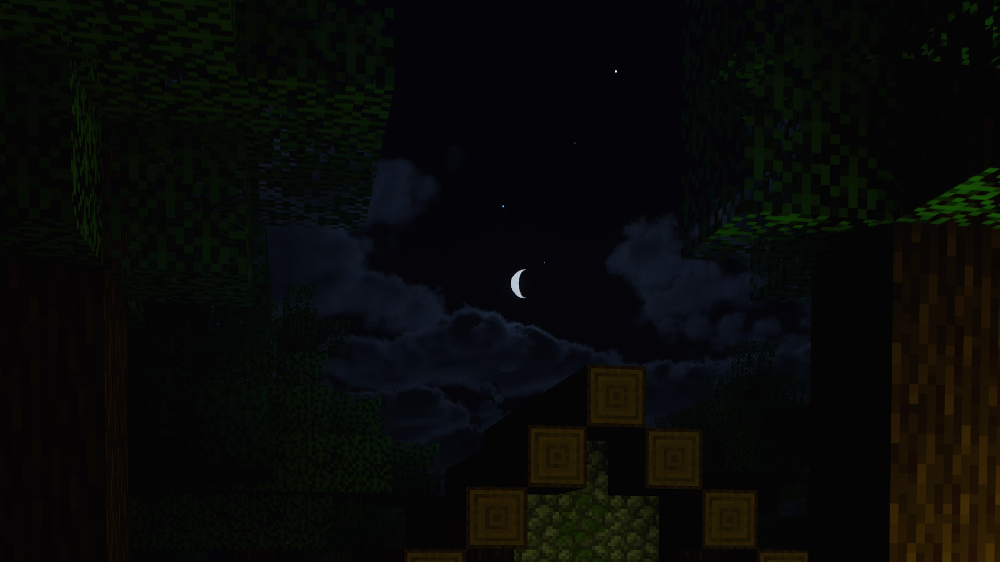
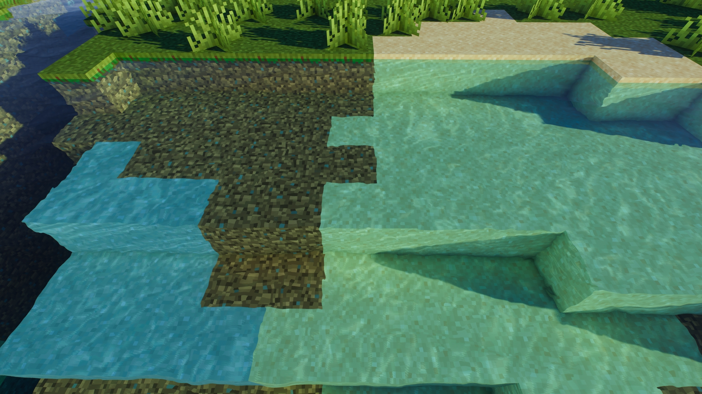

# MollyVX-Extension

**Please download MVXEx110.zip from 'Releases' on the right.**

## About MollyVX-Extension

This is a patch that adds several extensions to the shader pack MollyVX.

MollyVX is Minecraft shader developed by Rutherin and is available through paid tier membership on Patreon.
https://www.patreon.com/rutherin

Requires the shader pack MollyVX-10-25-2022.zip. You can create MollyVX-Extension.zip by patching that shader pack.

## Summary of features added

- Drawing rain particle  
    
- Drawing the moon shapes according to moon phases. The brightness of the moonlight also changes according to moon phases.  
    
- Drawing water caustics  
    
- Improve refraction. Including water refraction added.
- Fixed the timing of the emission change when changing the emitter item held in hand
- Rendering spider eyes with correct brightness
- Rendering beaconbeam with correct brightness
- Prevents appearing puddles in dry biomes
- Tinting transmitted light through stained glass pane as same color  
    
- Add a setting to expand the range of IrradianceCache  

  and so on

All other changes can be found in the PDF document included in the download.

## Requirements

- Original MollyVX (MollyVX-10-25-2022.zip)
- OptiFine 1.17.1 or newer  
  *Note:This shader is NOT support Iris!*

## How to create MollyVX-Extension

The patch is provided as diff text file (unified format).
Apply it to original shader pack using patch tool.

As a patch tool for Windows, included GNU patch, which is released under the GPL at 
https://gnuwin32.sourceforge.net/packages/patch.htm
The GnuWin_patch folder contains the Binaries, Documentation, and Sources required for redistribution.

Tool for Windows to automate patching will also be included.

### How to use

1. Extract MVXEx###.zip.
2. Double-click the shortcut 'mollyvx_patch' in the extracted folder to launch it.
The process is created using a PowerShell script. PowerShell scripts(.ps1) cannot be executed by double-clicking, and must be launched from the shortcut 'mollyvx_patch' that has been granted permission to run the script. Note that the included patch.exe is a patch tool that is called as a command within this tool, and double-clicking it will not process anything.
3. Click the \[Browse...] button to specify the original shader pack ZIP file. This file is only referenced and will not be directly overwritten.
4. Press the \[Start] button to begin processing. When complete, MollyVX-Extension###.zip will be output to the same folder as this tool.

The completed MollyVX-Extension###.zip will only work with OptiFine.

---

I don't know if there are cases where patches are applied on OS other than Windows, but if you can manually execute the patch command on a non-Windows OS, it seems possible to apply it. However, there is one line in the difference that contains the § symbol (double section), but § could not be processed by any diff/patch tool for Windows (it becomes garbled). Therefore, as a workaround, § is replaced with @ and processed. In other words, before patching, you need to manually change § to @ in the corresponding part of the original source to be patched. You can see the location of the corresponding part by looking at the PowerShell script. The difference text file is written using @ instead of §, so patch will work properly now.
