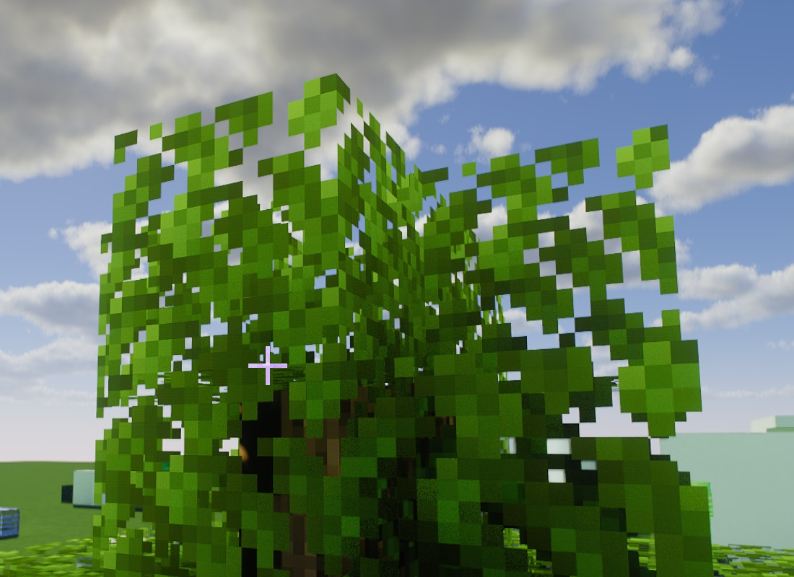
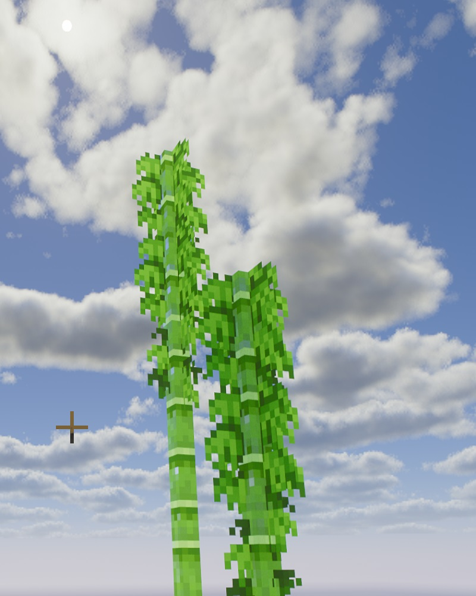
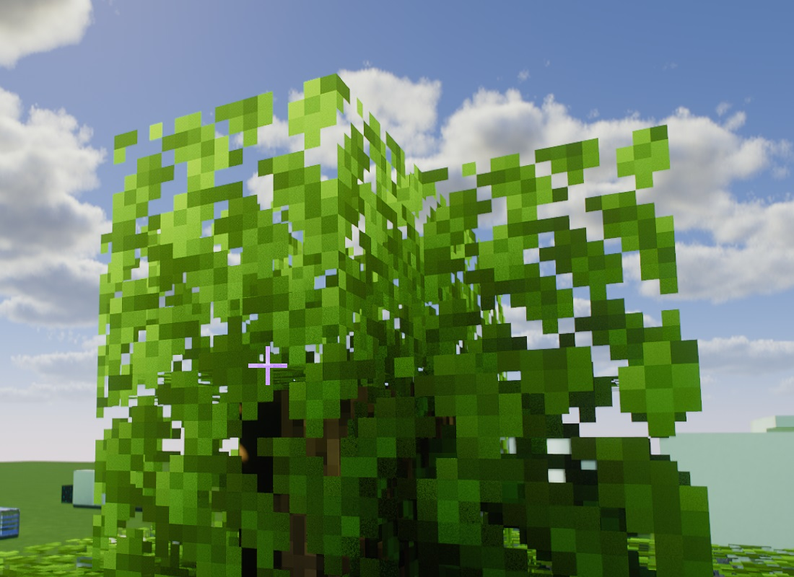
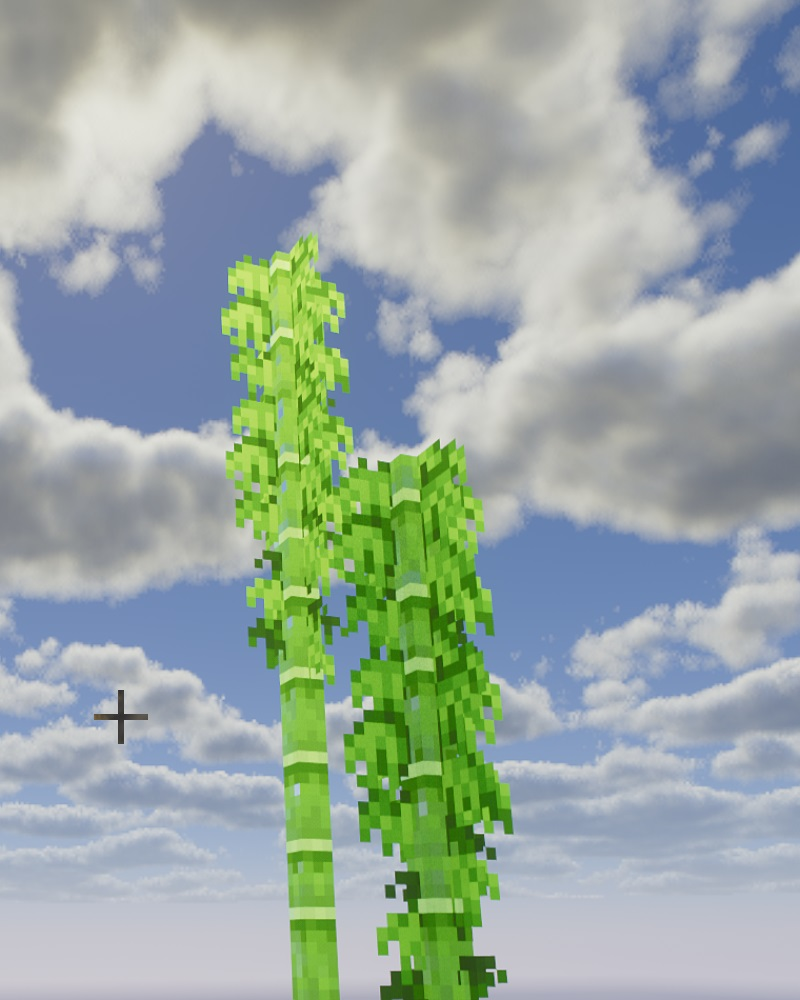
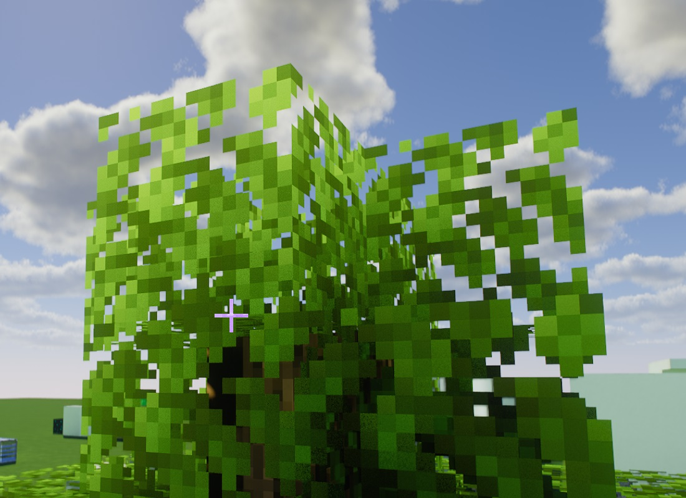
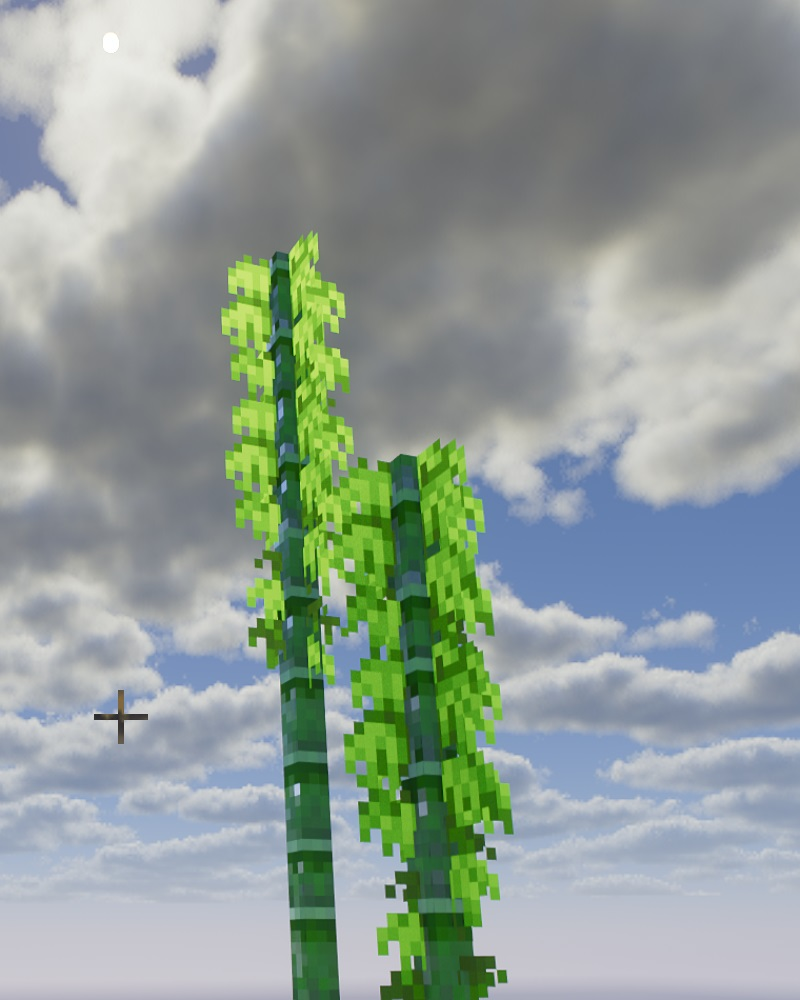
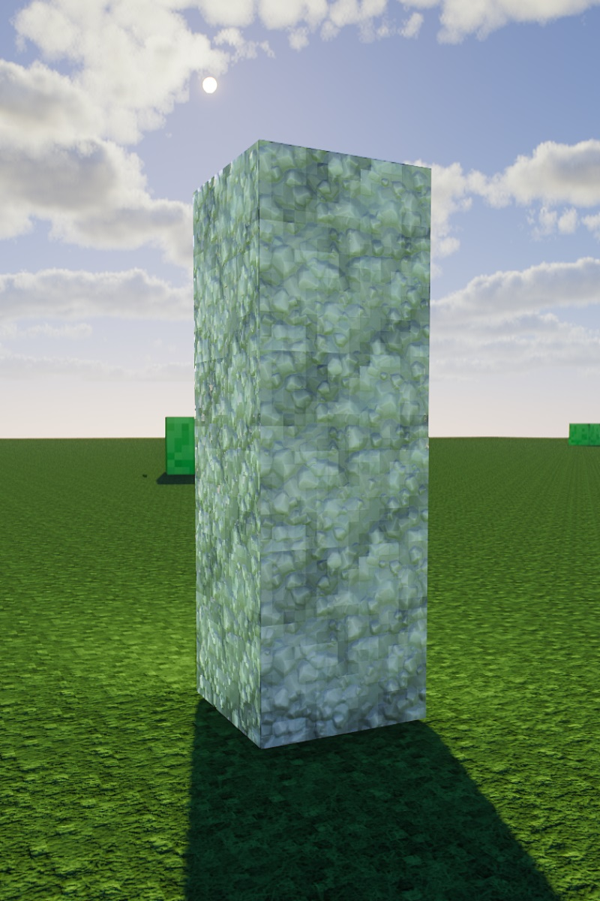
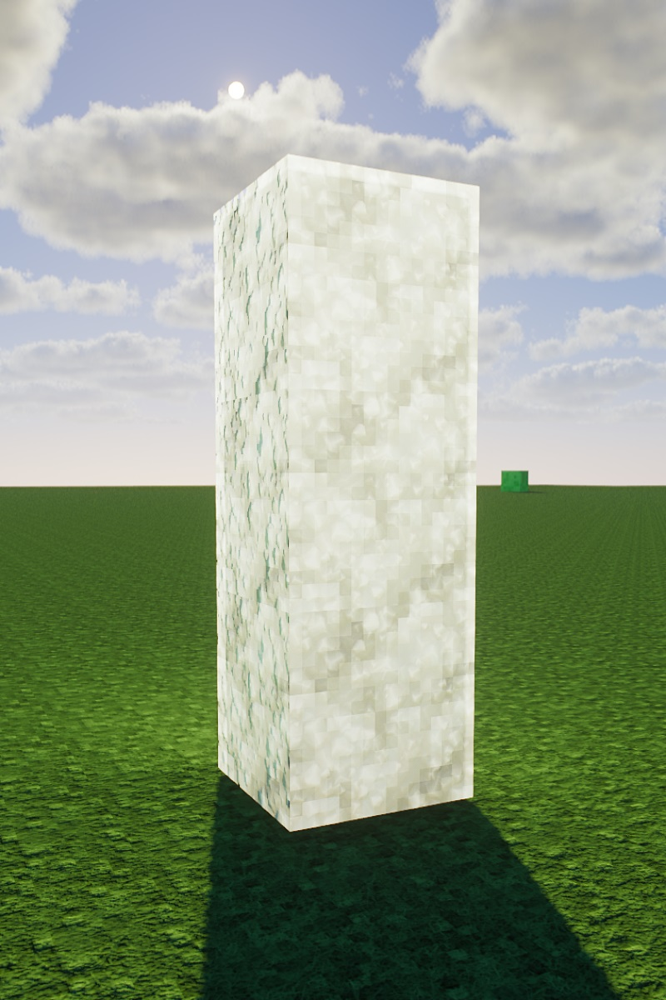

# Sample of SSS based on LabPBR with MollyVX-Extension + texture pack

MollyVX implements SSS(subsurface scattering) for plants as internal process of the shader. This does not support anything other than plants.  
When turn ON Resource_Pack_SSS in the MollyVX-Extension settings, SSS based on LabPBR supplied by the texture pack will be enabled.

- non SSS (SubSurfaceScattering = OFF) with texture pack 'Groovy'  
     
- SSS by internal process of shader (*Default: SubSurfaceScattering = ON and Resource_Pack_SSS = OFF) with texture pack 'Groovy'  
     
- SSS based on LabPBR (SubSurfaceScattering = ON and Resource_Pack_SSS = ON) with texture pack 'Groovy'  
     
- Default (SubSurfaceScattering = ON and Resource_Pack_SSS = OFF) with texture pack 'HardTop-Vanillaccurate'  
    
- SSS based on LabPBR (SubSurfaceScattering = ON and Resource_Pack_SSS = ON) with texture pack 'HardTop-Vanillaccurate'  
    
